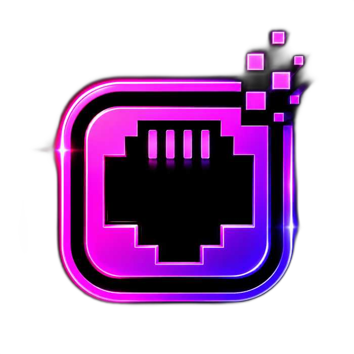

<h1 align="center">Hi, I'm Armin</h1>

- Backend Engineer with a strong focus on Platform Engineering and Infrastructure.
- Building PlayLAN, a distributed gaming platform focused on low-latency networking and service reliability.
- Experienced with Docker, Linux, PostgreSQL, Redis, observability, and production operations.
- Building backend services and APIs with Node.js, Go, Express, Gin, SQL, and NoSQL databases.
- Comfortable working with monitoring, logging, automation, CI/CD, and self-hosted infrastructure.
- Interested in platform engineering, cybersecurity, networking, and distributed systems.

  

  
  &nbsp;
  

<h3 align="left">Tech Stack</h3>

    
    
    
    
    
    
    
    
    
    
    
    
    
    
    

